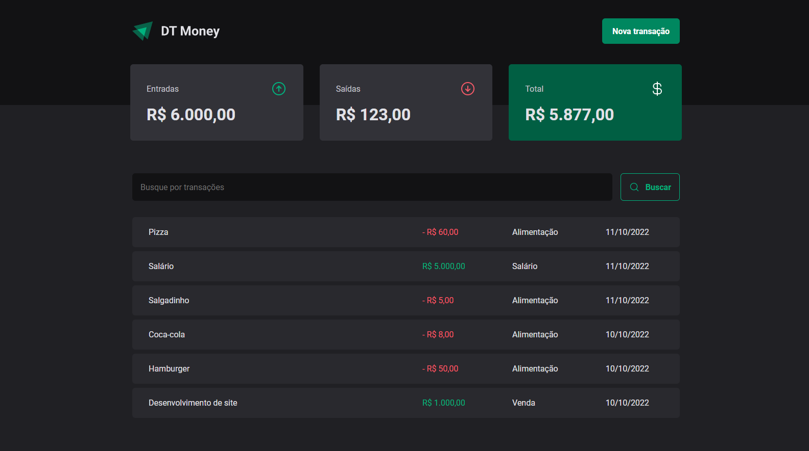

# DT Money

 <br/> <br/>

## Funcionalidades da aplicação
- Cadastro de transações de entrada/saída
- Filtro de transações

## Tecnologias utilizadas
- React
- TypeScript
- Styled Components
- Axios
- Radix UI
- zod
- React Hook Form
- Vite

### Instalação
1. Clone o repositório:

```bash
git clone https://github.com/jlefilho/dt-money.git
```

2. Acesse a pasta do projeto:

```bash
cd dt-money
```

3. Instale as dependências necessárias:

```bash
npm install
```

4. Suba o server:

```bash
npm run dev:server
```

5. Execute o projeto:

```bash
npm run dev
```
